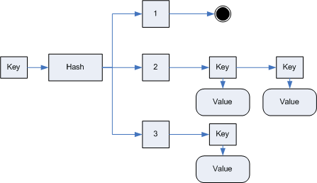

This is a mirror of Laurent Dupuis's Minimal Perfect Hash implementation in C#.

Internet Archive WaybackMachine link: https://web.archive.org/web/20190323024247/http://www.dupuis.me/node/9

Original blog post below

# Minimum Perfect Hash in C#
*Mon, 2010/09/27 - 11:33 — laurent*

Hash tables are one of the most powerful ways for searching data based on a key. The main issue with traditional hash function is the hash value collisions:

The search algorithm must recheck the key against a list of element sharing the same hash. This can cause some major performance issues:
Some hash values remains unused (e.g. 1 here) while other are heavily loaded
The scan of the list of keys can be expensive
The search time is no more constant

To avoid this issue, a new family of algorithms have been developed to create minimal perfect hash functions:
Perfect because for a predefined set of keys there is no collision
Minimal because the number of hash values (m) is as clause to the number of keys as possible (n)

With such hash functions, the hash table can be limited to a simple pointer array. The search time will always be constant. However, if the set of keys changes (by adding a record for example) then the hash function must be regenerated.

The following C# project is an adaptation of the CMPH implementation of the “Compress, Hash and Displace” algorithm:

The code is in full C# and has been tested with Win32 and Win64.

2013-03-01 Edit: I received the following email from Dr. Amjad Daoud asking me to quote that part of the CHD Algorithm is very close/identical to his own [CACM1992 Algorithm II](http://dl.acm.org/citation.cfm?id=129623) he published in his thesis in 1992, 17 years before the [CDH paper](http://cmph.sourceforge.net/papers/esa09.pdf) from F. C. Botelho, D. Belazzougui and M. Dietzfelbinger. For more information, please see [this page](https://web.archive.org/web/20190323024247/http://www.dupuis.me/node/31).
